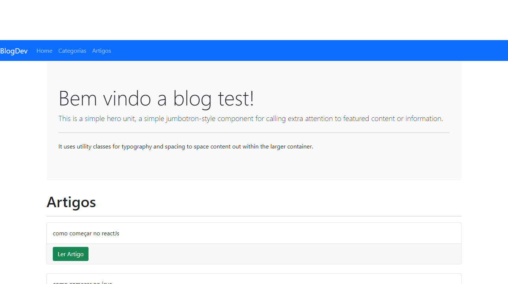
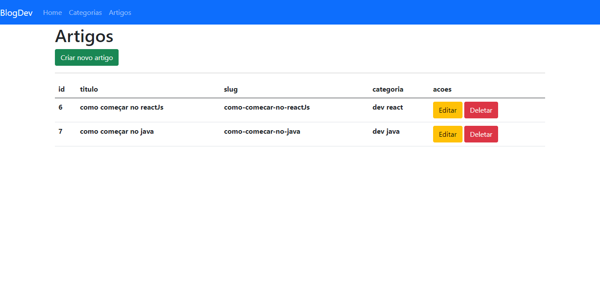
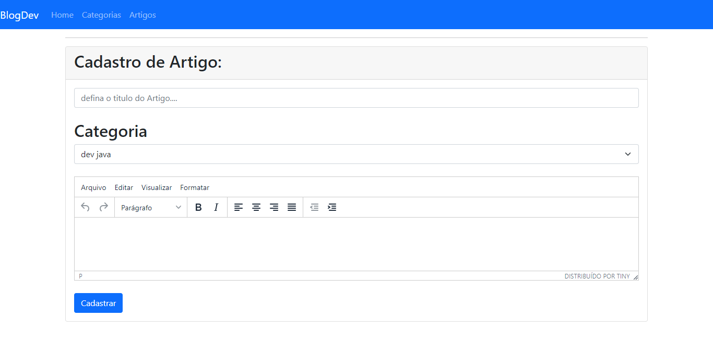
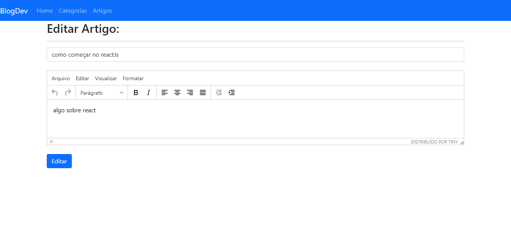
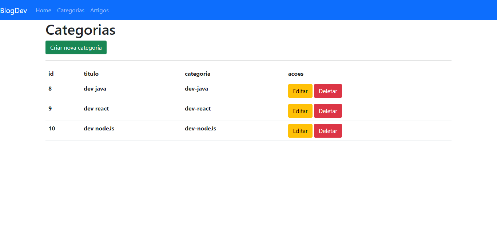
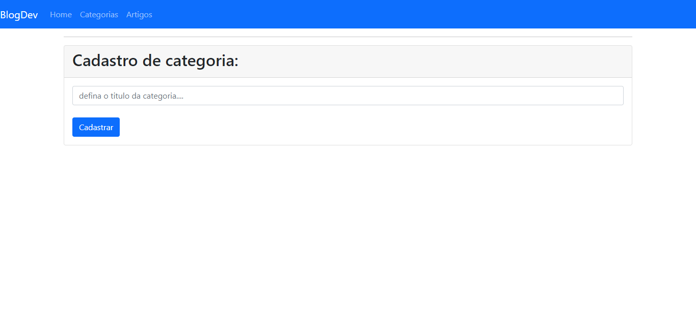
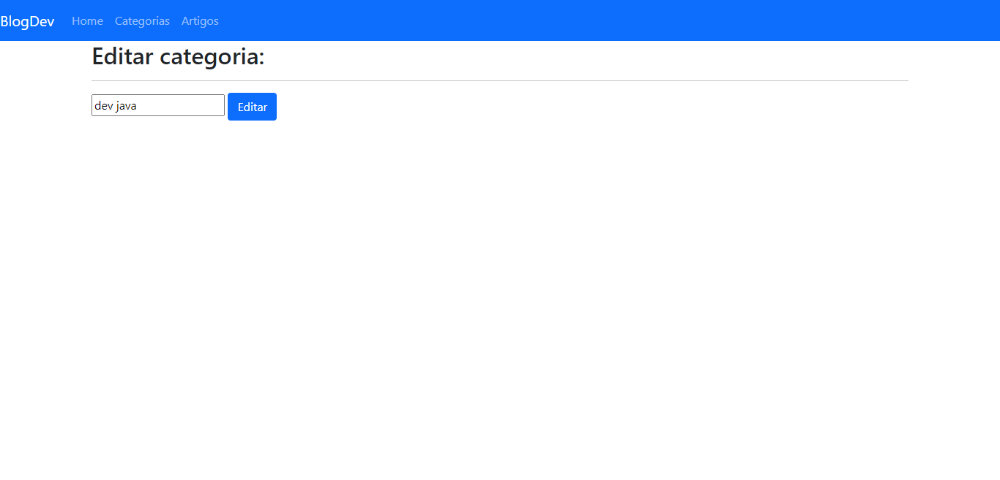
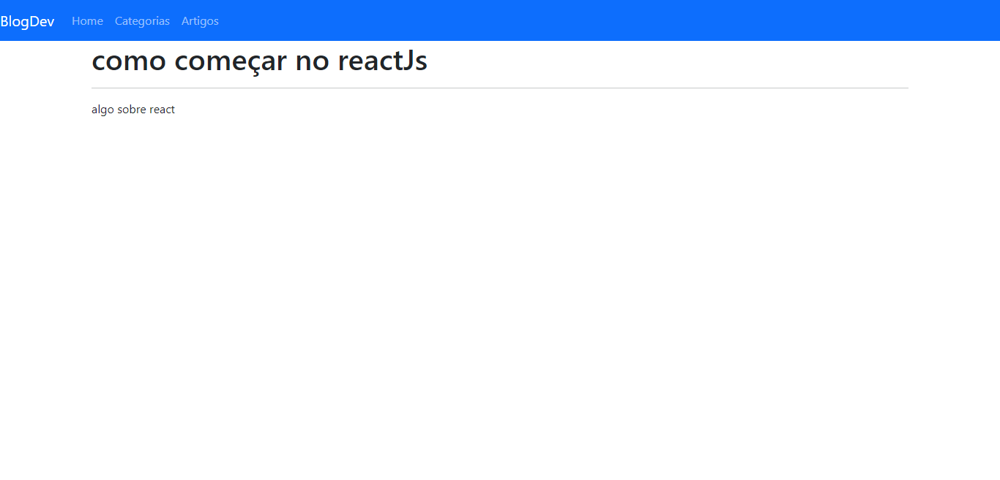

# BLOG
- Desenvolvido usando Stacks JS
- Autor: Gabriel Felipe

## Sobre
Projeto simples desenvolvido com o intuito de ser um Blog para desenvolvedores

## ⚒️ Tech
O projeto utilizou as seguintes tecnologias:

- [Twitter Bootstrap] - Framework para facilitar a ciracão do front-end
- [node.js] - utilizado para o desenvolvimento do Back-end
- [Express] - utilizado para facilitar o desenvolvimento da aplicação
- [Ejs] - foi o mecanismo de exibição do projeto
- [Sequelize] - responsavel pelo banco de dados

## Screenshots do projeto
### Home

   

### Artigos

   

### Criar Artigo

   

### Editar Artigo

   

### Categorias 

   

### Criar Categoria

   

### Editar Categoria

   

### Artigo Aberto

   

# OBSERVAÇÃO
> O projeto foi desenvolvido com foco na minha evolução principalmente na parte do back-end com nodeJs.
